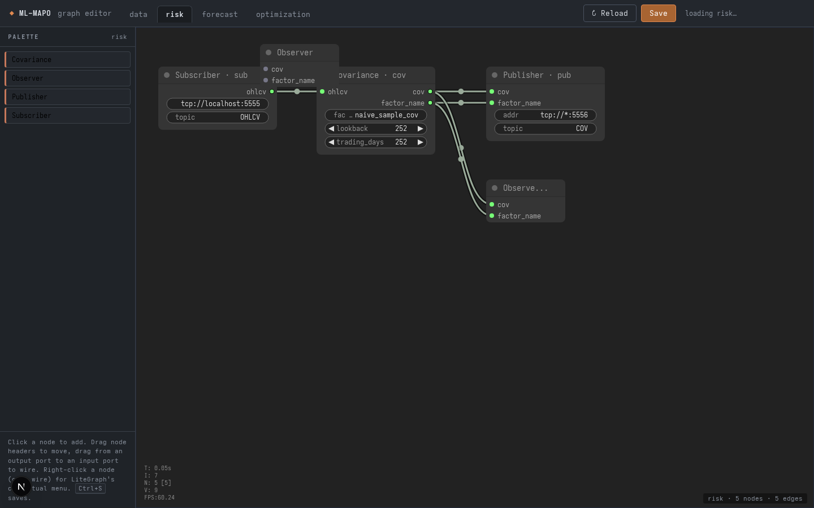

# ml-mapo
Machine Learning Multi-Asset Portfolio Optimizer (ML-MAPO)

@Philip Trealeaven, UCL Computer Science

## Dependencies
- Linux
- TimescaleDB
- Python (uv) — ≥ 3.14 per [pyproject.toml](pyproject.toml)
- Node ≥ 20 (for the browser editor under [web-ui/my-app/](web-ui/my-app/))
- Docker (optional, for the DB)

## Build
Install the python dependencies using `uv`. This will install packages including pytorch, pandas, etc.
```zsh
$ uv sync
```

Activate the Python uv environment:
```zsh
$ source .venv/bin/activate
```

(Optional) Alternatively, use `uv run` instead of `python`:
```zsh
$ uv run python --version
``` 

Install PostgresSQL and TimescaleDB following the tutorial [here](https://github.com/timescale/timescaledb) And connect to the database:

```zsh
$ docker run -d --name timescaledb \
    -p 6543:5432 \
    -e POSTGRES_PASSWORD=password \
    timescale/timescaledb-ha:pg18

$ psql -h localhost -p 6543 -U postgres
```

(Optional) If use Docker, you may need to reconnect to the db.

```zsh
$ docker ps -a
$ docker start <your-db-service>
```

Run the prototype in CLI:
```zsh
$ uv run python prototype/main.py
```

Start the web ui:
```zsh
$ cd web-ui/my-app
$ npm install
$ npm run dev
```

## Graph pipeline

Each of the four prototype modules (`data`, `risk`, `forecast`, `optimization`)
is now a DAG of `Node` classes defined in its `main.py` and wired together by a
JSON blueprint beside it (`<module>/graph.json`). At startup the module loads
the graph, topologically sorts it, calls `setup()` once, and runs `tick()`
forever. ZMQ PUB/SUB still bridges modules; the graph only describes what
happens *inside* one module per tick.

- Runtime: [prototype/graph.py](prototype/graph.py)
- Blueprints: [data/graph.json](prototype/data/graph.json),
  [risk/graph.json](prototype/risk/graph.json),
  [forecast/graph.json](prototype/forecast/graph.json),
  [optimization/graph.json](prototype/optimization/graph.json)

### Run the graph pipeline

Exactly the same as the non-graph run — the supervisor spawns each module,
which loads its own `graph.json`:

```zsh
$ uv run python prototype/main.py
```

You'll see a `graph loaded` line per module on startup, e.g.
`graph loaded path=…/data/graph.json nodes=6`.

To run a single module standalone (handy for debugging one graph in
isolation; downstream modules block on `recv` until upstream publishes):

```zsh
$ uv run python prototype/risk/main.py
```

### Edit graphs in the browser

The editor is a Next.js 16 + React 19 app under [web-ui/my-app/](web-ui/my-app/)
using [LiteGraph.js](https://github.com/comfyanonymous/litegraph.js) (the
same canvas library ComfyUI is built on) for the node canvas. API routes
call [prototype/graph_cli.py](prototype/graph_cli.py) for the node schema
registry and read/write each module's `graph.json` directly.

```zsh
$ cd web-ui/my-app
$ npm install                # one-time
$ npm run dev                # opens http://localhost:3000
# navigate to http://localhost:3000/graph
```

Pick a module from the tabs (`data` / `risk` / `forecast` / `optimization`),
click a palette entry to add a node, drag node headers and wires with the
mouse, edit parameters in LiteGraph's per-node widgets, and <kbd>Ctrl+S</kbd>
(or **Save**) writes `<module>/graph.json`. Restart the pipeline (or the
single module) for saved changes to take effect.



Endpoints (all under the Next.js app):
- `GET /graph` — the editor SPA.
- `GET /api/modules` — list modules.
- `GET /api/graph/schemas[?refresh=1]` — spawns
  [prototype/graph_cli.py](prototype/graph_cli.py) to collect every
  `@register_node`-decorated class across modules. Cached in-process; use
  `?refresh=1` after editing node source.
- `GET /api/graph/<module>` — read the module's `graph.json`.
- `PUT /api/graph/<module>` — validate and overwrite the module's
  `graph.json`. Rejects unknown node types, duplicate ids, and edges that
  reference nonexistent nodes.

The named-port ↔ LiteGraph slot-index translation lives in
[web-ui/my-app/lib/convert.ts](web-ui/my-app/lib/convert.ts); everything else
(server, on-disk format, tests) stays in port-name land.

### Add a new node type

1. Subclass `graph.Node` inside the module's `main.py`, declare
   `INPUTS` / `OUTPUTS` / `PARAMS` / `CATEGORY`, implement `process(**inputs)`
   (and optionally `setup` / `teardown`), and decorate with
   `@register_node("<module>/YourNode")`.
2. Add an entry to the module's `graph.json` (or drop the node in the editor
   and hit Save).
3. In the editor, a page reload picks up the new schema; `GET
   /api/graph/schemas?refresh=1` forces the server-side cache to drop.

### Tests

```zsh
$ cd web-ui/my-app
$ npx playwright install chromium      # one-time, needs browser libs
$ npm run dev &                        # start the app on :3000
$ PORT=3000 node tests/smoke.mjs       # headless Chromium E2E
```

`tests/smoke.mjs` boots a headless Chromium, drives the editor through
initial load, tab switch, palette-add, save, and reload, and verifies the
on-disk `graph.json` round-trips. It restores every `graph.json` at the end
so the repo is unchanged after a run.